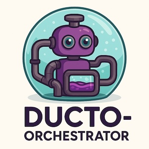

<!--suppress HtmlDeprecatedAttribute -->
<p align="right">
    <a href="https://github.com/tommed" title="See Project Ducto">
        
    </a>
</p>

# Ducto Orchestrator

[](https://github.com/tommed/ducto-dsl/actions/workflows/ci.yml)

> Lightweight, embeddable data-stream orchestrator using [Ducto-DSL](https://github.com/tommed/ducto-dsl)

---

## ✨ What is Ducto-Orchestrator?

<p align="center">
  
</p>

Ducto-Orchestrator is a modular, highly extensible, stream-processing engine designed to transform JSON-like data using the `Ducto-DSL`. It is capable of running as:

- A **local CLI**
- A **Google Cloud Function**
- A **Pub/Sub processor**
- A future-proof base for AWS, Azure, or custom pipelines

It is the recommended runtime for automating, transforming, and routing event-driven data using Ducto.

---

## ✅ Features

- Embeds the [Ducto-DSL](https://github.com/tommed/ducto-dsl) engine
- Supports stdin/stdout for easy CLI usage
- Cloud-friendly (GCP Pub/Sub to Pub/Sub ready)
- Modular input/output & processing layers
- Ready for future `feature-flag` integration
- Clean architecture for minimal vendor lock-in
- OpenTelemetry-ready

---

## 🟣 Typical Pipeline

```
[input] -> [pre-processors] -> [ducto-dsl] -> [post-processors] -> [output]
```

---

## ✅ Example Use-Cases

- Lightweight Event Routing
- Telemetry pre-processing
- Feature Flag Enrichment (planned)
- Secure Payload Sanitization
- Serverless Event Transformation

---

## 🚀 Getting Started

### Install CLI

```bash
go install github.com/tommed/ducto-orchestrator/cmd/ducto-orchestrator@latest
```

### Run Example (stdin → transform → stdout)

```bash
echo '{"foo": "bar"}' | ducto-orchestrator --program ./examples/example.json
```

---

## 🛣️ Roadmap

- [ ] GCP Edition (Cloud Function: pubsub → pubsub)
- [ ] HTTP Trigger Support
- [ ] Feature Flag Processor
- [ ] Output Attribute Projection
- [ ] Logging Layer
- [ ] Embeddable SDK Mode
- [ ] AWS & Azure Editions
- [ ] Playground (WebAssembly + Vue3)

---

## 🤖 Related Projects

- [ducto-dsl](https://github.com/tommed/ducto-dsl) — The DSL engine powering Ducto-Orchestrator

---

## 📜 License

[MIT](./LICENSE)