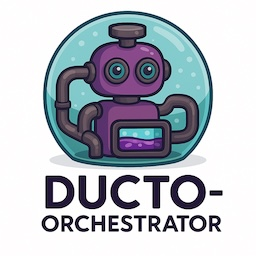
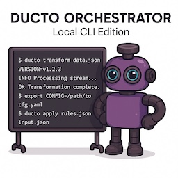
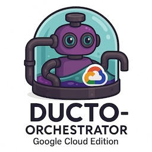
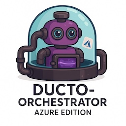
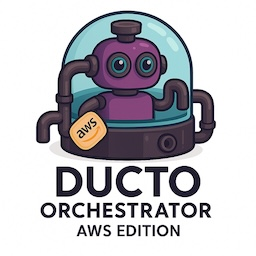
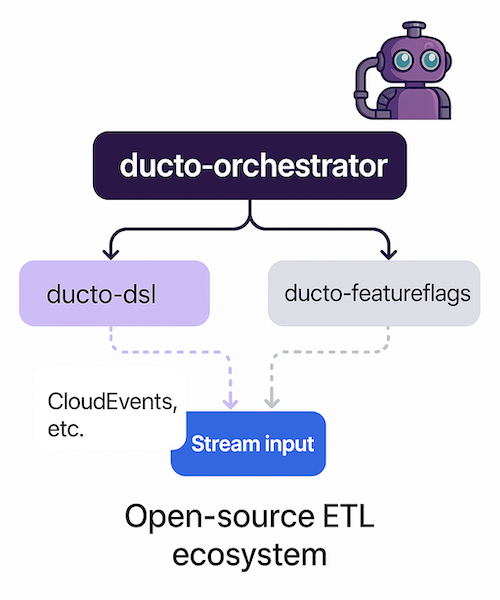

<!--suppress HtmlDeprecatedAttribute -->
<p align="right">
    <a href="https://github.com/tommed" title="See Project Ducto">
        
    </a>
</p>

# Ducto Orchestrator

[](https://github.com/tommed/ducto-dsl/actions/workflows/ci.yml)
[](https://codecov.io/gh/tommed/ducto-orchestrator)

> Lightweight, embeddable data-stream orchestrator using [Ducto-DSL](https://github.com/tommed/ducto-dsl)

---

## ✨ What is Ducto-Orchestrator?

<p align="center">
  
</p>

Ducto-Orchestrator is a modular, highly extensible, stream-processing engine designed to transform JSON-like data using the `Ducto-DSL`. It is capable of running as:

- A **local CLI**
- A **Google Cloud Function**
- A **Pub/Sub processor**
- A future-proof base for AWS, Azure, or custom pipelines

It is the recommended runtime for automating, transforming, and routing event-driven data using Ducto.

---

## ✅ Features

- Embeds the [Ducto-DSL](https://github.com/tommed/ducto-dsl) engine
- Supports stdin/stdout for easy CLI usage
- Cloud-friendly (GCP Pub/Sub to Pub/Sub ready)
- Modular input/output & processing layers
- Ready for future `feature-flag` integration
- Clean architecture for minimal vendor lock-in
- OpenTelemetry-ready

You can also check the [specifications here](docs/specs.md).

---

## 🟣 Typical Pipeline

```
[input] -> [pre-processors] -> [ducto-dsl] -> [post-processors] -> [output]
```

---

## ✅ Example Use-Cases

- Lightweight Event Routing
- Telemetry pre-processing
- Feature Flag Enrichment (planned)
- Secure Payload Sanitization
- Serverless Event Transformation

---

## 🚀 Getting Started

### Install CLI

```bash
go install github.com/tommed/ducto-orchestrator/cmd/ducto-orchestrator@latest
```

### Run Example (stdin → transform → stdout)

```bash
echo '{"foo": "bar"}' | ducto-orchestrator -config examples/01-simplest.yaml
```

```yaml
# example/http-source.yaml

# Set here, or use -debug when calling the orchestrator
debug: true

# Program by filepath...
program_file: 01-simplest_program.json
# ...Or embed the program in your config file
#program:
#  version: 1
#  instructions: []

source:
  type: http
  config:
    addr: ":8080"
    meta_field: "_http"

output:
  type: stdout
  config:
    pretty: true

```

---

## 🛣️ Roadmap

- [x] Local CLI
- [x] HTTP Trigger Support
- [x] HTTP PUT/POST Output Writer
- [ ] GCP Edition (Cloud Function: pubsub → pubsub)
- [x] Feature Flag Processor
- [ ] Output Attribute Projection
- [ ] Logging Layer
- [ ] Embeddable SDK Mode
- [ ] AWS & Azure Editions
- [ ] Playground (WebAssembly + Vue3)

### Variations Planned

Ducto for your local command line: 



Ducto running in Google Cloud:



Ducto running in Microsoft Azure:



Ducto running in Amazon Web Services (AWS):



---

## 🧑‍💻 Contributing

Please see our [Contributing Guide](./CONTRIBUTING.md).

---

## 🤖 Related Projects



- [ducto-dsl](https://github.com/tommed/ducto-dsl) - The DSL engine powering Ducto-Orchestrator
- [ducto-featureflags](https://github.com/tommed/ducto-featureflags) - A lightweight, embeddable, and pluggable feature flag engine

---

## 📜 License

- Code is all licensed under [MIT](./LICENSE)
- The Ducto name, logos and robot illustrations (and likeness) are (C) Copyright 2025 Tom Medhurst, all rights reserved.
