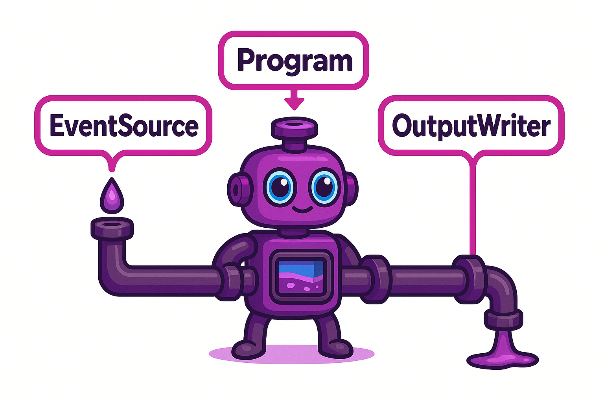
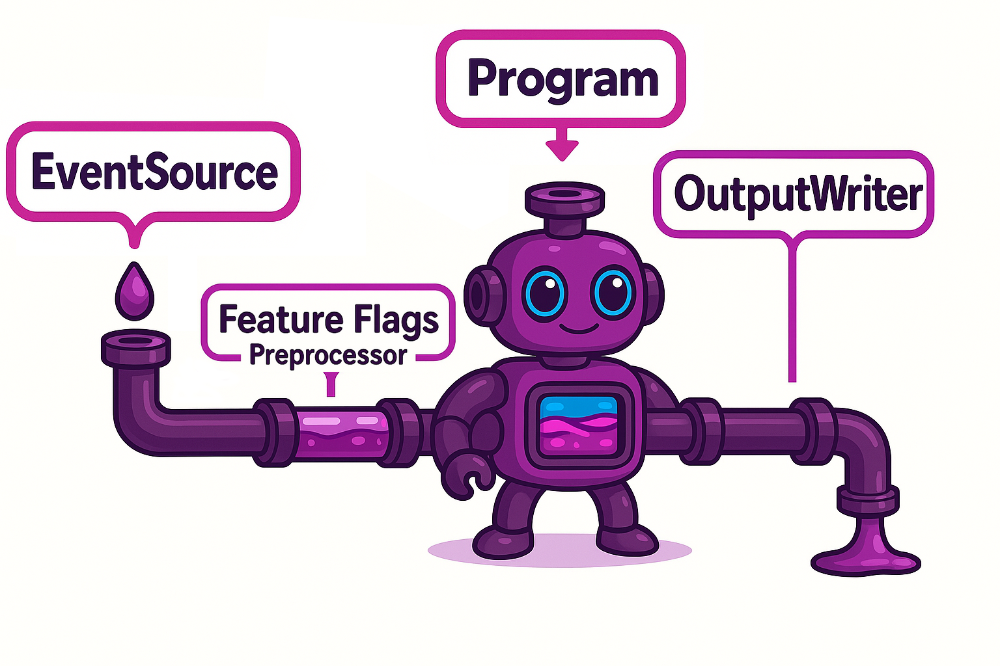

<!--suppress HtmlDeprecatedAttribute -->
<p align="right">
    <a href="https://github.com/tommed" title="See Project Ducto">
        
    </a>
</p>

# Ducto Orchestrator: Getting Started

## The 3-Stage Orchestrator 

At its heart, Ducto is a transformation engine which uses 
[our DSL](https://github.com/tommed/ducto-dsl) to perform 
changes on any JSON object.

The Orchestrator is a pipeline that is configured to take these JSON objects from a 
source (known as an `EventSource`), pass it through our transformation engine 
(the instructions for this are known as the `Program`), and then write the result
somewhere using an `OutputWriter`.

Here's our cute robot 'Ducto' to demonstrate:

<!--suppress HtmlDeprecatedAttribute -->
<p align="center">
  
</p>

As a concrete example, let's imagine the following using the `ducto-orchestrator` CLI:
1. A JSON object is sent into the program using `stdin`
2. A transformation 'Program' is loaded from a local JSON file and the instructions are applied to the JSON object
3. The transformed JSON object is written to `stdout`

We actually have an example to match this: [01-simplest.yaml](../examples/01-simplest.yaml).

In this situation, we have `stdin -> program -> stdout` as our pipeline. Simple eh?!

Check out [ducto-dsl](https://github.com/tommed/ducto-dsl) to see all the supported 
transformations - or, build your own!

---
## The 4-Stage Orchestrator (Feature Flags)

To make Ducto even more powerful, we can introduce a 'Preprocessor' prior to 
transforming the JSON object. One such preprocessor we can use is 
[ducto-featureflags](https://github.com/tommed/ducto-featureflags). This preprocessor essentially adds
a field called `_flags` to your JSON object, which you can use in your `Program`.

The cool part? You can change these flags remotely _on the fly_ using conditions, adjusting 
the functionality of your orchestrators. For example, you can label some of your 
deployed orchestrators with tags like `env=production`, `region=USA`, or `group=beta` and then
have your orchestrator call a remote feature flags service to resolve the latest flags.
This call takes your tags and provides a customised set of flags. You can set things 
like `"use_beta_logic": true` in your transformation to apply experimental logic on certain deployments,
or adjust where the data is sent based on the `region` or `customer` tag.

The power and possibilities are endless!

<!--suppress HtmlDeprecatedAttribute -->
<p align="center">
  
</p>

Check out the [live_feature_flags.yaml](../examples/live_feature_flags.yaml) example to 
see this working, and [ducto-featureflags](https://github.com/tommed/ducto-featureflags)
for more information about this component.

---
## Install CLI

```bash
go install github.com/tommed/ducto-orchestrator/cmd/ducto-orchestrator@latest
```

### Run Example (`stdin → transform → stdout`)

```bash
echo '{"foo": "bar"}' | ducto-orchestrator -config examples/01-simplest.yaml
```

---
## Related Projects
- [ducto-dsl](https://github.com/tommed/ducto-dsl) - The DSL engine powering Ducto-Orchestrator
- [ducto-featureflags](https://github.com/tommed/ducto-featureflags) - A lightweight, embeddable, and pluggable feature flag engine
